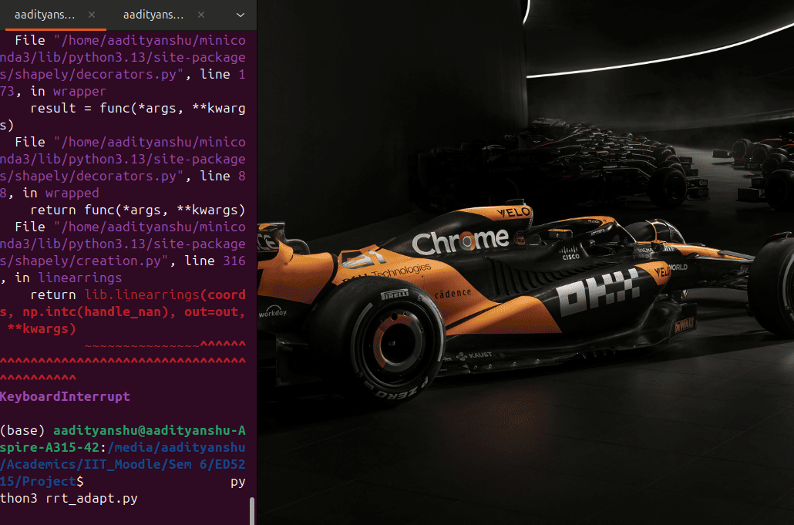

# Dynamic Path Planning with Adaptive RRT*

A Python simulation of real-time dynamic path planning using an adaptive RRT* (Rapidly-exploring Random Tree Star) algorithm. The planner navigates a robot through a 2D environment with both static and moving obstacles, continuously replanning when the current path is obstructed.

---

## Overview

This project implements and compares several path planning algorithms in a 2D pygame simulation environment, with the primary contribution being an adaptive RRT* variant that responds to dynamic obstacles in real time. When a moving obstacle intersects the planned path, the planner preserves the safe portion of the path and seamlessly initiates a replan from the last safe position.

The work was developed as part of the **ED5215** course project.

---

## Demo



---

## Features

- **RRT\*** — Optimal sampling-based path planning with rewiring for cost minimisation
- **Adaptive Replanning** — Detects path obstruction mid-execution and replans from the last safe waypoint
- **Moving Obstacles** — Polygon obstacles with configurable velocity, travel distance, and pause behaviour
- **Static Obstacles** — Arbitrary convex polygon obstacles
- **Collision Checking** — Robot-radius-aware line and point collision detection using Shapely
- **Visual Simulation** — Real-time pygame rendering with tree expansion, path history, and obstacle animation
- **Comparison Algorithms** — A*, Adaptive A*, LPA* implementations included for benchmarking

---

## Repository Structure

```
├── rrt_adapt.py          # Main: Adaptive RRT* with moving obstacles (primary file)
├── RRT_.py               # Base RRT* implementation
├── A_star.py             # Standard A* implementation
├── Aadi_Astar.py         # Modified A* variant
├── adaptive_astar.py     # Adaptive A* implementation
├── adapt_as.py           # Adaptive A* variant
├── map_rrts.py           # RRT* with map visualisation
├── map_lpas.py           # LPA* with map visualisation
├── map_v1.py             # Map environment v1
├── display_node.py       # Node display utilities
├── disp_node.py          # Display node variant
├── ajan_env.py           # Environment definition
├── ED5215 Project Proposal.pdf
├── ED5215_ Project MidTerm (P3 AT Path Planning).pdf
├── ED5215_ Final Project Presentation.pdf
```

---

## Dependencies

```bash
pip install pygame numpy shapely
```

| Package   | Purpose                              |
|-----------|--------------------------------------|
| `pygame`  | 2D rendering and simulation loop     |
| `numpy`   | Vector math and random sampling      |
| `shapely` | Polygon collision detection          |

---

## Running the Simulation

```bash
python rrt_adapt.py
```

The simulation opens a 700×700 window. The planner builds the RRT* tree (shown in blue), finds a path to the goal (shown in green), and monitors for obstruction by the moving obstacle. When blocked, it saves the safe path segment and replans automatically.

---

## Algorithm Parameters

Configurable constants at the top of `rrt_adapt.py`:

| Parameter          | Default | Description                                      |
|--------------------|---------|--------------------------------------------------|
| `STEP_SIZE`        | 15      | Maximum extension per RRT iteration              |
| `MAX_ITER`         | 1500    | Maximum tree nodes before replanning gives up    |
| `GOAL_SAMPLE_RATE` | 0.05    | Probability of sampling the goal directly        |
| `NEIGHBOR_RADIUS`  | 40      | Radius for RRT* neighbour search and rewiring    |
| `ROBOT_RADIUS`     | 10      | Robot size used for collision buffer             |

---

## Environment Configuration

**Static obstacles** are defined as Shapely polygons in `rrt_adapt.py`:

```python
obstacles = [
    Polygon([(100, 0), (400, 0), (400, 200), (100, 200)]),
    ...
]
```

**Moving obstacles** use the `SquareMover` class:

```python
moving_obstacles = [
    SquareMover(
        start_pos=(300, 100),   # Top-left corner
        size=100,               # Square side length
        travel_distance=100,    # Vertical travel range
        speed=0.67,             # Pixels per frame
        pause_duration=2        # Seconds to pause at each end
    )
]
```

---

## How Adaptive Replanning Works

1. After an initial path is found, each frame checks whether any moving obstacle intersects the planned path (`is_path_obstructed`)
2. If an obstruction is detected at segment `i`, the safe sub-path up to segment `i` is preserved and drawn in darker green
3. A new `RRTStar` instance is initialised from the last safe waypoint with the same goal
4. The planner runs step-by-step (`find_path_step`) during the pygame loop until a new path is found
5. Execution continues on the new path, repeating the process as needed

---

## Academic Context

This project was submitted for **ED5215** (Motion Planning / Robotics elective). The proposal, midterm, and final presentation PDFs are included in the repository for reference.

---

## Authors

- **Aadityanshu Abhinav**
- **Anuj** (collaborative development — see `anuj*.py` variants)
